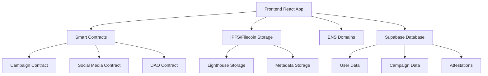
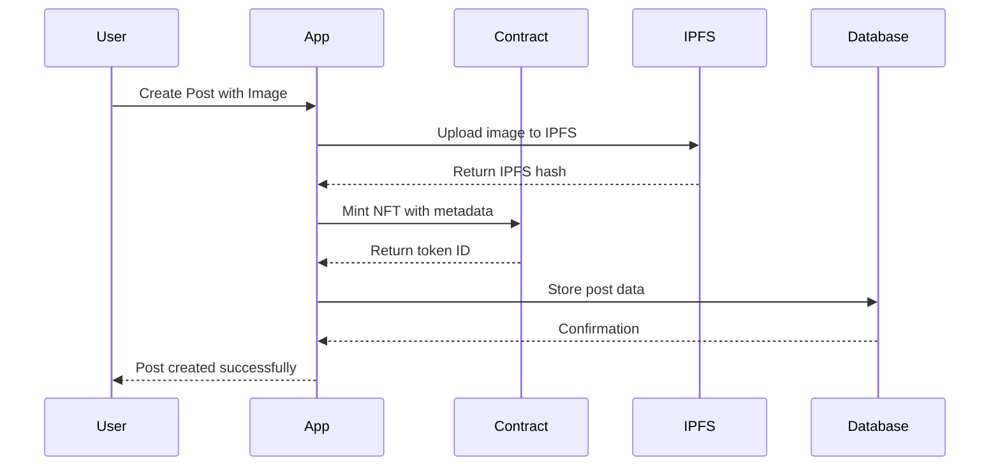
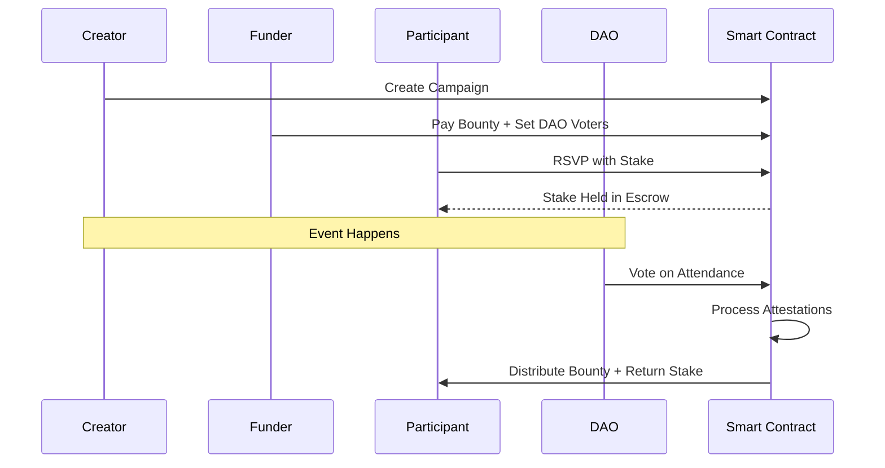
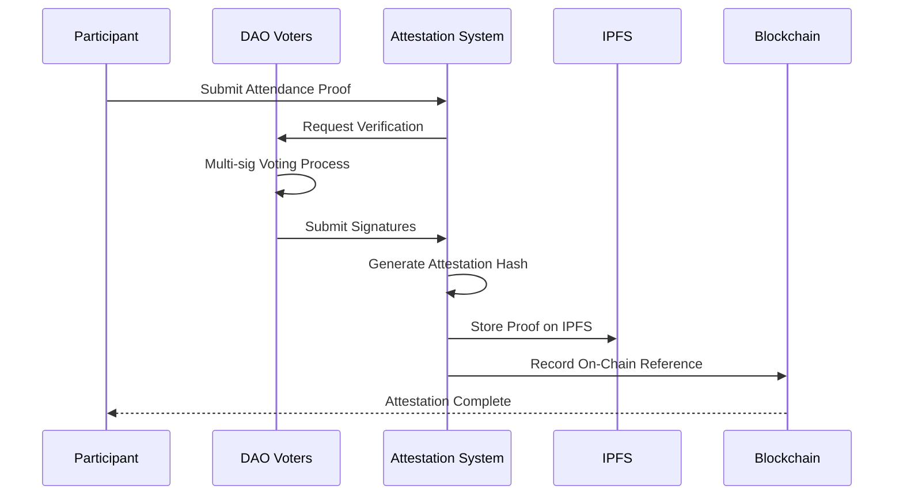
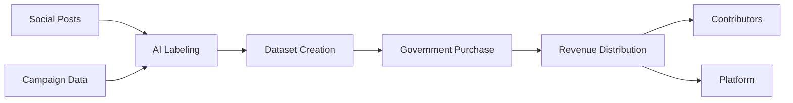

# 🌍 ImpactChain - Web3 Social Impact Platform

<div align="center">

[Demo Link](https://app.supademo.com/demo/cmg2xdgpp01wk1y0i2v3vmaet?utm_source=link)

**Empowering Communities Through Blockchain-Verified Social Impact**

[](https://reactjs.org/)
[](https://worldcoin.org/)
[](https://filecoin.io/)
[](https://ens.domains/)
[](LICENSE)

</div>

## 🚀 Overview

ImpactChain is a revolutionary Web3 social impact platform that combines social media, campaign management, and data monetization to create verified, blockchain-backed social good initiatives. Our platform enables users to document their social impact work, organize community campaigns with bounty rewards, and monetize collected impact data for governmental and organizational use.

### 🌟 Key Features

- **📱 Social Impact Posts**: Create NFT-backed posts of your social work with IPFS metadata storage
- **🎯 Campaign Management**: Organize community events with bounty rewards and DAO verification
- **🗳️ Decentralized Verification**: DAO-based attestation system for campaign participation
- **💰 Economic Incentives**: Stake-based RSVP system with bounty rewards for verified participants
- **📊 Data Monetization**: AI-labeled impact data sold as datasets to governments and organizations
- **🎪 Cheer System**: Support impactful posts with cryptocurrency payments
- **🏛️ ENS Integration**: Subdomain-based identity system for enhanced user experience

## 🏗️ Architecture

### Core Components



### Technology Stack


#### 🔗 Blockchain & Web3
- **World Chain**: Primary blockchain for smart contract deployment
- **ENS Domains**: Decentralized identity and subdomain management
- **Ethers.js**: Blockchain interaction library
- **Wagmi**: React hooks for Ethereum

#### 📁 Storage & Data
- **Filecoin/IPFS**: Decentralized storage for media and metadata
- **Lighthouse**: IPFS pinning and storage management
- **Supabase**: Centralized database for app state and relationships

#### 🎨 Frontend
- **React 18 + TypeScript**: Modern React with type safety
- **Vite**: Fast build tool and development server
- **Tailwind CSS**: Utility-first CSS framework
- **Framer Motion**: Animation library
- **GSAP**: Advanced animations
- **React Query**: Data fetching and caching

#### 🔧 Development Tools
- **ESLint**: Code linting
- **TypeScript**: Type checking
- **Zustand**: State management

## 🚀 Quick Start

### Prerequisites

- Node.js 18+ and npm/yarn
- Git
- Wallet with World Chain testnet/mainnet access

### Installation

1. **Clone the repository**
   ```bash
   git clone https://github.com/NikhilKottoli/EthGlobal2025.git
   cd EthGlobal2025
   ```

2. **Install dependencies**
   ```bash
   # Frontend
   cd frontend
   npm install
   
   # Backend services
   cd ../jsBacked
   npm install
   
   cd ../photo-pipeline
   npm install
   ```

3. **Environment Setup**
   
   Create `.env` files in respective directories:
   
   **Frontend (.env)**
   ```env
   VITE_SUPABASE_URL=your_supabase_url
   VITE_SUPABASE_ANON_KEY=your_supabase_anon_key
   VITE_LIGHTHOUSE_API_KEY=your_lighthouse_api_key
   VITE_PINATA_JWT=your_pinata_jwt
   VITE_WORLD_CHAIN_RPC_URL=your_world_chain_rpc
   VITE_CONTRACT_ADDRESS=deployed_contract_address
   ```

4. **Database Setup**
   
   Run the database schema from `frontend/docs/database-schema.md` in your Supabase instance.

5. **Smart Contract Deployment**
   ```bash
   # Deploy contracts to World Chain
   # See contracts/ directory for deployment scripts
   ```

6. **Start Development Servers**
   ```bash
   # Frontend
   cd frontend && npm run dev
   
   # Backend services
   cd jsBacked && npm start
   cd photo-pipeline && npm start
   ```

## 📋 Core Workflows

### 1. 📱 Social Media Posts Flow



**Features:**
- Upload images and descriptions of social impact work
- Automatic NFT minting with IPFS metadata
- AI labeling for data categorization
- Community engagement through likes and cheers
- Cheer system allows monetary appreciation

### 2. 🎯 Campaign & Bounty Flow



**Campaign Types:**
- **Fundraiser Campaigns**: Community-funded initiatives
- **Self-Funded Campaigns**: Creator-funded events

**Staking Mechanism:**
- Participants stake cryptocurrency to RSVP
- Verified attendees receive stake back + bounty share
- Unverified participants forfeit stake to verified pool

### 3. 🗳️ Attestation Flow



**Verification Process:**
- Campaign funder assigns trusted DAO voters
- Voters independently verify attendance
- Multi-signature attestation system
- Cryptographic proof stored on IPFS
- On-chain attestation reference for immutability

### 4. 📊 Dataset Monetization



**Monetization Strategy:**
- Aggregate impact data from posts and campaigns
- AI-powered labeling and categorization
- Create purchasable datasets for:
  - Government infrastructure planning
  - NGO impact measurement
  - Urban planning initiatives
- Revenue sharing with data contributors

## 🎨 User Interface

### Key Pages & Components

- **🏠 Landing Page**: Platform introduction and wallet connection
- **📱 Social Feed**: Browse and interact with impact posts
- **🎯 Campaign Hub**: Discover and join community campaigns
- **📊 Dashboard**: Personal impact metrics and earnings
- **👤 Profile Builder**: ENS-based profile management
- **🏛️ DAO Interface**: Voting and attestation management

### 🎪 ENS Integration

- **Subdomain Creation**: Users can create personalized subdomains
- **Identity Management**: ENS-based profile system
- **Social Features**: Follow users via ENS names
- **Campaign URLs**: Human-readable campaign addresses

## 📜 Smart Contracts

### Core Contracts

#### 1. `CampaignBountyManager.sol`
- **Purpose**: Campaign creation, bounty escrow, RSVP staking
- **Key Functions**:
  - `createCampaign()`: Initialize new campaigns
  - `payBountyToEscrow()`: Fund campaigns with bounties
  - `rsvpToCampaign()`: Stake-based participation
  - `completeCampaign()`: Distribute rewards post-verification

#### 2. `SocialMediaContract.sol`
- **Purpose**: NFT minting for social posts
- **Key Functions**:
  - `mintPost()`: Create NFT for social impact posts
  - `cheerPost()`: Monetary appreciation system

#### 3. `DataDAO.sol`
- **Purpose**: Decentralized verification and governance
- **Key Functions**:
  - `assignVoters()`: Set campaign verifiers
  - `submitVote()`: Attendance verification voting
  - `generateAttestation()`: Create cryptographic proofs

### Contract Deployment

Contracts are deployed on World Chain with the following addresses:
- Campaign Manager: `0x...` (to be deployed)
- Social Media: `0x...` (to be deployed)
- DAO Contract: `0x...` (to be deployed)

## 🗄️ Database Schema

Our hybrid architecture uses both on-chain and off-chain storage:

### Key Tables
- **Users**: Profile data and reputation scores
- **Social Posts**: Content metadata and engagement metrics
- **Campaigns**: Event details and participation tracking
- **Attestations**: Verification proofs and DAO voting records
- **Datasets**: Monetized data packages and revenue tracking

*Full schema available in `frontend/docs/database-schema.md`*

## 🔒 Security & Privacy

### Security Measures
- **Smart Contract Auditing**: Comprehensive security reviews
- **Multi-Signature Verification**: DAO-based attestation system
- **Stake-Based Participation**: Economic incentives for honest behavior
- **IPFS Content Addressing**: Immutable content storage

### Privacy Considerations
- **Pseudonymous Participation**: Wallet-based identity
- **Optional Profile Information**: User-controlled data sharing
- **Decentralized Storage**: No single point of failure
- **ENS Privacy**: Optional identity revelation

## 🤝 Contributing

We welcome contributions to ImpactChain! Please follow these steps:

1. **Fork the repository**
2. **Create a feature branch**: `git checkout -b feature/amazing-feature`
3. **Commit your changes**: `git commit -m 'Add amazing feature'`
4. **Push to the branch**: `git push origin feature/amazing-feature`
5. **Open a Pull Request**

### Development Guidelines
- Follow TypeScript best practices
- Write comprehensive tests
- Update documentation for new features
- Follow the existing code style
- Test smart contract changes thoroughly

## 📄 License

This project is licensed under the MIT License - see the [LICENSE](LICENSE) file for details.

## 🙏 Acknowledgments

- **World Chain** for providing scalable blockchain infrastructure
- **ENS Domains** for decentralized identity solutions
- **Filecoin/IPFS** for decentralized storage capabilities
- **Lighthouse** for IPFS pinning services
- **Supabase** for reliable database infrastructure

## 📞 Contact & Support

- **Project Repository**: [GitHub](https://github.com/NikhilKottoli/EthGlobal2025)
- **Documentation**: [Project Docs](frontend/docs/)
- **Issues**: [GitHub Issues](https://github.com/NikhilKottoli/EthGlobal2025/issues)

---


<div align="center">

**🌍 Making Social Impact Verifiable, Sustainable, and Rewarding**

Built with ❤️ for EthGlobal 2025

</div>
